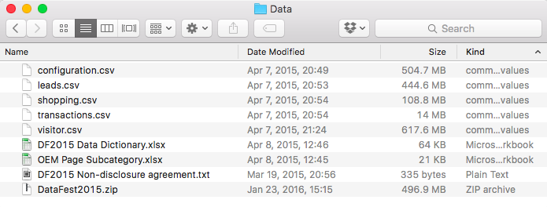

```{r setup, include=FALSE}
knitr::opts_chunk$set(echo = TRUE, warning = FALSE, message = FALSE)
```

## Outline

> - Getting ready.
> - Reading in data.
> - Forming data to answer questions.
> - Save/Write.
> - **GOAL: ** Learn how to use `readr`, `tidyr` & `dplyr`.

## Setup

- OSX (10.11.3)
    - 4 GB RAM
- `R` (3.2.3)
- `Rstudio` (0.99.869)

#### Packages

```{r, eval = FALSE}
install.packages(c("readr", "tidyr", "dplyr"))
```

```{r}
library(readr) # (0.2.2)
library(tidyr) # (0.4.0)
library(dplyr) # (0.4.3)
```

```{r}
library(ggplot2)
library(reshape2)
```


## Pipes `%>%`

- Imported from the `magrittr` package.
    - Super useful in the _Hadleyverse_.
    - Makes code more readable.
- Takes objects on the left and pipes the object into:
    (1) the first argument of the function on the right or 
    (2) where we place a `.`
```{r, eval = FALSE}
mtcars %>% head(n = 2)
mtcars %>% lm(mpg ~ disp, data = .)
```


# Getting ready.

## Getting the data:

- Step one: Download it ( [PUT LINK TO DATA HERE]() )
- Step two: Figure out what the hell is in it.



_5 data files 2 dictionaries_.

## {.flexbox .vcenter}

**BEFORE YOUR READ-IN YOUR DATA**

**STOP AND READ ABOUT WHAT IT IS**

## DF2015 Data Dictionary

`visitor.csv`

> This table contains **one row for each unique visitor** to Edmunds and describes that visitor's journey through the site as well as any other data we know about them.  There are records about which pages were viewed, how long was spent doing various things, which ads were seen and many other data points about the visitor journey.  **We have limited this table to only contains records for visitors that eventually submitted a lead on the site.**

- _Lead_: A _lead_ occurs when a visitor expresses interest in a _specific vehicle at a specific dealership_ and then submits some form of contact information.

<!--
## DF2015 Data Dictionary

`shopping.csv`

> This table basically contains a vehicle browsing history of each visitor from the `visitor` table, showing which vehicles were seen during the visitor journey through our web site.


## DF2015 Data Dictionary

`configuration.csv`

> This table is all options that a user selects when looking for a specific price on a certain vehicle.  For example, color, sun roof, audio system etc. The k\_uuid is the variable to denote the single configuration.  So if one visitor\_key has 3 unique k\_uuids then they completed the configuration process three times and all the options with the same k_uuid were selected for that single configuration.


## DF2015 Data Dictionary

`transactions.csv`

> Some Edmunds' Dealer partners provide us with confirmation that Edmunds visitors who submitted leads then actually purchased a vehicle from the dealership where the lead was sent.  This table contains detailed information about those purchases.  There is one row per transaction with several columns of detail, including date, vehicle data and some customer data.  For privacy reasons all personally identifiable information has been excluded.
-->

# Reading in data.

## Reading in Large Data

- DataFest files are typically _large_.
    - Able to analyze on many laptops (sometimes painfully).
- `base::read.csv()` can be slow and annoying.
- `readr::read_csv()` tends to be faster, more flexible and less annoying.

## `read_csv()` vs. `read.csv()`

```{r, cache = TRUE}
system.time(read.csv("Data/visitor.csv"))
system.time(read_csv("Data/visitor.csv"))
```

- `read_csv()` is way faster that `read.csv()`


## {.flexbox .vcenter}

Switch to `RStudio` and use `read_csv()` and `read.csv()` to read-in the `visitor` data. Then look for differences.


## DF2015 Data Dictionary

`leads.csv`

> This table contains information about any leads that the visitors from the Visitor table submitted during their journey through the site. There is one row per lead in the table with several columns of detail about the lead.  For privacy reasons all personally identifiable information has been excluded.


## {.flexbox .vcenter}

Now use `read_csv()` to load the `leads` data and solve the `problems()`.


## View and Review

> - What does each observation in the `visitors` data represent?
> - Name 3 reasons why `read_csv()` is superior to `read.csv()`.


# Forming data.

## What is _tidy_ data?

- Need two things for a _tidy_ data:
    1. Rows are individual observations.
    2. Columns are measurements, more commonly variables, about each observation.
- Two forms of _tidy_ data:
    1. _Long_
    2. _Wide_


## DF2015 Data Dictionary

`shopping.csv`

> This table basically contains a vehicle browsing history of each visitor from the `visitor` table, showing which vehicles were seen during the visitor journey through our web site.


## {.flexbox .vcenter}

Use `read_csv()` to read in the `shopping` data. Then spread the values out to make it _wide_

## {.flexbox .vcenter}

Use `gather()` to convert the first 10 rows of `visitor` data to a _long_ format. Contrast this with the slightly more robust `melt()` function in `reshape2` package. Plot this _long_ data as a faceted histogram.

## Our new friends

- Helpful `dplyr` functions:
    1. `select()`: Choose variables (by name or column number)
    2. `slice()`: By row number.
    3. `filter()`: Subset data based on values of variables.
    4. `mutate()`: Add variables or change existing variables in place.
    5. `summarize()`: Reduce data to a table of summaries
    6. `arrange()`: Re-order rows based on variable values
    7. `group_by()`: Perform operations based on categorical variables.
    
    
## {.flexbox .vcenter}


## Thinking through `*_join`s.

- `join`s are data frame operations that combine two sets of data.
    - Typically combine based on one or more common variables.
- Need to carefully think through how we want to `join` data files.
- Do we want to:
    - Combine ALL observations and ALL variables for each data frame?
    - Combine ONLY those observations that are present in BOTH data frames?
    - Take the ONLY the observations from one data frame and ADD ON the variables from the other?


# Save & Write.

## `save()` vs. `write_csv()`

- Use `save()` to create data files for analysis with `R`.
```{r, eval = FALSE}
save(JOINED DATA FILE, file = "Data/JOINED DATA FILE.Rda")
```

- Use `write_csv()` to create a data file for use in other software.
```{r, eval = FALSE}
write_csv(JOINED DATA FILE, path = "Data/JOINED DATA FILE.Rda")
```


## {.flexbox .vcenter}

Questions?

## Resources

- [readr](https://github.com/hadley/readr)
- [tidyr](https://github.com/hadley/tidyr)
- [dplyr](https://github.com/hadley/dplyr)

- Also worth looking at the `vignettes` for each of these packages.